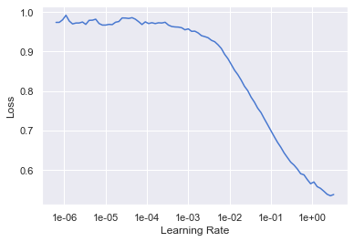
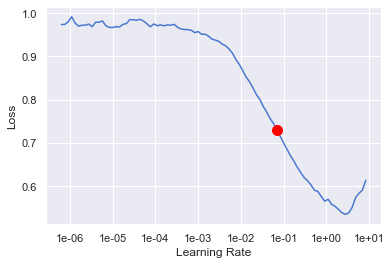

# tensorflow-on-steroids : 

## This repo contains the following:  

1. Replicated `OneCycleLR` learning rate scheduler from `PyTorch` into a `tf.keras` `callback` .   
   - [Original implementation by pytorch](https://pytorch.org/docs/stable/_modules/torch/optim/lr_scheduler.html#CyclicLR)
   - [My Version](https://github.com/benihime91/tensorflow-on-steroids/blob/master/one_cycle.py).

**Example :** 
```python

# Import `OneCycleLr`
from one_cycle import OneCycleLr

# Configs
max_lr = 5e-02
epochs = 5

# Istantiate `OneCycleLr`
one_c = OneCycleLr(max_lr=max_lr, steps_per_epoch=len(trn_ds), epochs=epochs)

# Instantiate CallbackList
cbs = [one_c, ...]

# Instantiate Optimizer & loss_fn
optim = keras.optimizers.SGD(momentum=0.9, clipvalue=0.1)
loss_fn = ...

# Compile Model
model.compile(optimizer=optim, loss=loss_fn, metrics=["acc"])

# Fit Model
h = model.fit(trn_ds, validation_data=val_ds, epochs=epochs, callbacks=cbs)

# to plot the learning_rate & momentum(or beta_1) graphs
one_c.plot_lrs_moms()
```
  


2. `Learning Rate Finder` for `tf.keras`
   - Main idea taken from the implementation of `lr_find` by [Fast.ai](https://docs.fast.ai/basic_train.html#lr_find)
   - Ideas taken from [How Do You Find A Good Learning Rate](https://sgugger.github.io/how-do-you-find-a-good-learning-rate.html).
   - [My Version](https://github.com/benihime91/tensorflow-on-steroids/blob/master/lr_find.py). 
  
**Example:**
```python
# Import LrFinder
from lr_find import LrFinder

# Instantiate Optimizer & loss_fn 
# [must be instance of tf.keras.Optimizers & tf.keras.Losses]
optimizer = ...
loss_fn = ...

# Instantiate LrFinder
lr_find = LrFinder(model, optimizer, loss_fn)

# Start range_test
lr_find.range_test(trn_ds)

# Plot LrFinder graphs
lr_find.plot_lrs()
```


```python
# Plot LrFinder graphs
lr_find.plot_lrs(skip_end=0, suggestion=True)
```


**NB: To check the usage of `lr_find` & `OneCycleLR` check this [notebook](https://github.com/benihime91/tensorflow-on-steroids/blob/master/nbs/one_cycle_%26_lr_finder_tf.ipynb).  
This notebook contains an end-to-end example using the `cats-vs-dogs` dataset from `Kaggle`** 

3. Example on how to use `Albumentations` for `image augmentation` with `Tensorflow's` `tf.data` API  
   - > Check this [notebook](https://github.com/benihime91/tensorflow-on-steroids/blob/master/nbs/albumentations_with_tensorflow.ipynb)   
There are some issues though with this implementation. Please check [this](https://github.com/albumentations-team/albumentations/issues/669#issuecomment-664422245).
Tried my best to showcase the examples where this is gonna work and not work.
